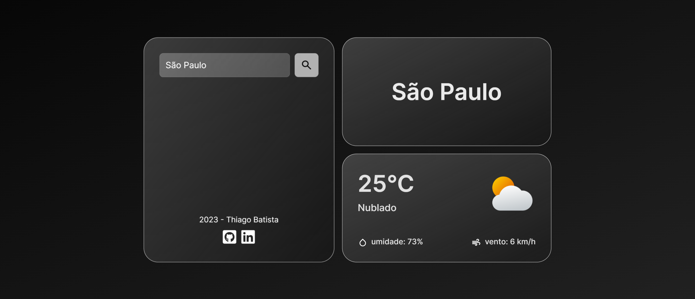
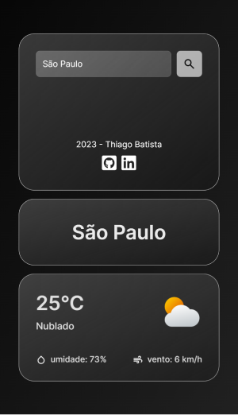
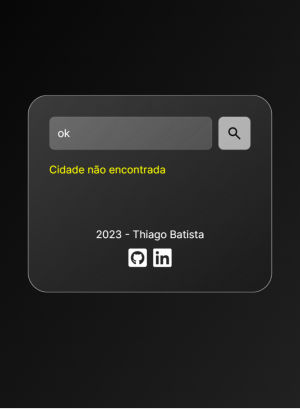

# Projeto - Previsão do Tempo
    
***
Esse projeto trata-se de um site para consultar o tempo, onde o usuário pesquisa pelo nome da cidade e obtém o retorno dos dados atuais do tempo. Para realizá-lo eu utilizei: ReactJS, TypeScript, Styled Components e a API OpenWeather para obter a temperatura, a umidade e a velocidade do vento da cidade.

##  🖥️ Imagens do projeto

 

## 🔗 Link da página
https://tsb-previsaodotempo.netlify.app/

## 👨‍💻 Tecnologias Utilizadas
* [ReactJS](https://pt-br.reactjs.org/docs/getting-started.html)
* [TypeScript](https://www.typescriptlang.org/docs/)
* [Styled-Components](https://styled-components.com/docs)
***
**Desenvolvido por: [Thiago Batista](https://github.com/ThiagoSantosBatista/).**